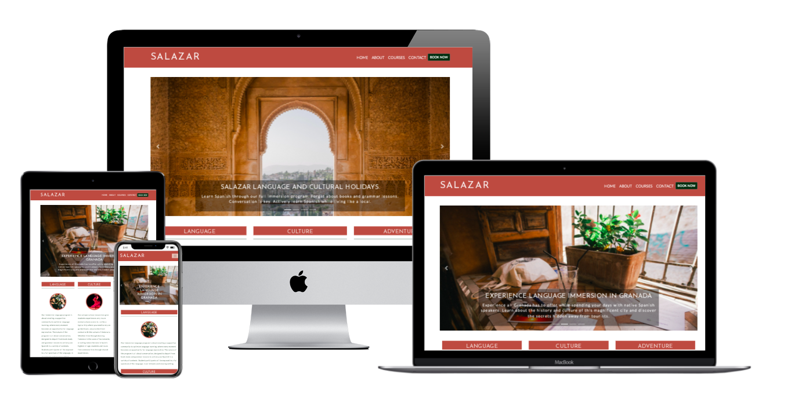

 [View Live Site Here](https://nikimacm.github.io/milestone-1-salazar)


# Salazar Language and Cultural Holidays

## Contents

[Overview](#overview)
* [UX](#ux)
    * [Project Goals](#project-goals)
    * [User Goals](#user-goals)
    * [User Stories](#user-stories)
    * [Site Owner Goals](#site-owner-goals)
    * [User requirements and expectations](#User-requirements-and-expectations)

* [DESIGN](#design)
    * [Design Choices](#design-choices)
    * [Colors](#colors)
    * [Fonts](#fonts)
    * [Structure](#structure)

* [WIREFRAMES](#wireframes)
    * [Home](#home)
    * [About](#about)
    * [Courses](#courses)
    * [Contact](#contact)
    * [Booking](#booking)

* [FEATURES](#features)
    * [Feature 1: Home Page](#home)
    * [Feature 2: About Page](#about)
    * [Feature 3: Courses Page](#courses)
    * [Feature 4: Contact Page](#contact)
    * [Feature 5: Booking Modal](#booking)

* [TECHNOLOGIES USED](#technologies)
    * [Github](#github)
    * [Gitpod](#gitpod)
    * [Google Fonts](#google-fonts)
    * [Font Awesome](#font-awesome)
    * [Bootstrap CDN](#bootstrap)
    * [jQuery](#jquery)
    * [Popper.js](#popper.js)
    * [WAVE](#wave)
    * [W3 HTML](#w3-html)
    * [Jigsaw CSS](#jigsaw-css)
    * [Balsamic](#balsamic)
    * [HTML Beautifier](#html-beautyfier)

* [TESTING](#testing)

* [BUGS](#bugs)

* [DEPLOYMENT](#deployment)

* [CREDITS](#credits)

### Overview <hr>
The aim of this project is to develop a website targeted at adults who wish to learn Spanish and aquire some cultural and local knowledge along the way. This is a fictitious company that specialises in language immersion as a means of learning Spanish in a fun and dynamic environment, while holidaying in the beautiful city of Granada, Spain. The website
will provide information on how this can be acheived through total immersion in Spanish life, while outlining the variety of options available,
such as length of course, accomodation, cultural activities, the buddy system and details regardiing our teaching method and philosophy.
 
### UX <hr>
#### Project Goals
The main goal of this project is to utilise the skills developed throughout the first three modules of the course to develop a fully functioning static website, which is useful, useable and valuable.
Both the visual and navigational elements of the site need to be user friendly and accessible. 

#### User Goals


1. To find information about the company, and language immersion in a straighforward and simple manner.

2. To know the price of the courses offered and what is included in this price.

3. To discover why these courses differ from others and what can be achieved by signing up. 

4. To be able to book directly from the site, courses and accomodation included.

5. The opportunity to read testimonials and view a gallery of photos to give a clearer idea of how the trip will be.

6. Find more information on the courses and activities by clicking onto the instagram, facebook, trip adviser and twitter links provided.

#### User Stories

7. As a potential customer, I would like to find all the info I need and the booking options available without complications.

8. As a newbie to the Spanish language, I'm keen to find out if the courses offered suit total beginners.

9. As a language and tourism student, I'm wondering if the courses will be beneficial to me while working towards my degree.

10. As someone who has a keen interest in history and Spanish culture I'd like to know how much of this is included in the program. So that I can decide if it's right for me.

11.  As a retired person who is not interested in the adventure activities I want to see the other options available to me before I make a decision.

12. As a lanuguage teacher in Ireland, I want to create a budget for a group of ten adult students, and hope the online booking platform can assist me in this.

13. As a person of reduced mobility, the site needs to show the options available to me, so I know this company will provide me with suitable accomodation, accessible learning conditions, transport options etc.

#### Site Owner Goals

14. Design a site which represents the services offered and will appeal to the target market using appropriate colour schemes, imagery, typography and useful information.

15. Ensure the site is easy to navigate and all information can be found by visitors within seconds.

16. Engage postential customers by outlining why the services are unique, trustworthy and valuable.

17. Increase website traffic from the target audience using tools such as google analytics, blogging and social media.

18. Generate leads by asking visitors to subscribe to a monthly newsletter.

19. Produce a site which is easily accessible on all sizes, mobile devices and browsers.

#### User Requirements and expectations

20. A fast loading time.

21. A website which is clear and easy to navigate.

22. Recognisable format, no surprises.

23. A well designed, aesthetically pleasing user interface.

24. The ability to make a decision based on site content.

25. A means to contact business owners directly for a more personal experience.


### DESIGN <hr>

#### DESIGN CHOICES

#### COLOURS

I chose this color scheme as it reflects the environment in which the company is based. The pinkish hues of the clay on many of the old buildings mixed with the dark green foliage surrounding them. I had planned on making more use of the yellow colour seen here but in the end it didn't really fir in with the content and the style I was trying to convey.

-  `#09280a`
-  `#e1c1b7`
-  `#b05449`
-  `#dbb238`

#### FONTS

The fonts I have chosen to use are Josefin Sans and Lato with sans-serif as a backup font. I chose Josefin Sans due to the elegant style and vintage feel, which I think represents the city in which the school is based. I thought Lato was a good match as it's simplicity and elegance.

#### IMAGES

I have used many images throughout the site to attract potential customers and covey the message that this is a holiday as well as an opportunity to learn the language. 
The images used were downloaded from https://unsplash.com/ which is a source of freely useable, fully licenced images. Credits for each image can be found below in the [CREDITS](#credits) section.

### WIREFRAMES <hr>


#### Home

* [desktop-home](docs/wireframes/desktop-home.png)

* [mobile-home](docs/wireframes/mobile-home.png)

#### About

* [desktop-about](docs/wireframes/desktop-about.png)

* [mobile-about](docs/wireframes/mobile-about.png)

#### Courses

* [desktop-courses](docs/wireframes/desktop-courses.png)

* [mobile-courses](docs/wireframes/mobile-courses.png)

#### Contact

* [desktop-contact](docs/wireframes/desktop-contact.png)

* [mobile-contact](docs/wireframes/mobile-contact.png)

#### Booking

* [desktop-booking](docs/wireframes/desktop-Book.png)

* [mobile-booking](docs/wireframes/mobile-Book.png)

### FEATURES <hr>


#### Feature 1: Home Page
* Navbar with the option of clicking Book Now to produce a modal with booking options.

* Carousal giving snippets of information about the company and photos of Granada.

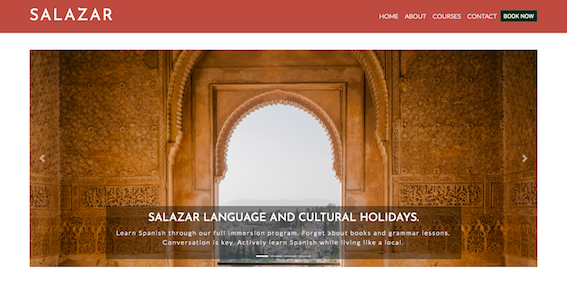

* Information section which provides information on the three main areas the company specialises in. 

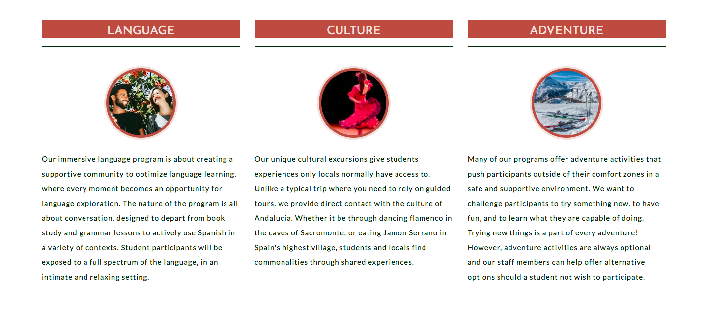


* Testamonial section where you can read reviews of previous customers.


* Footer which provides a clickable icon to bring you to the contact page where you can request more information. There are also Trip Advisor, Instagram, Twitter and facebook icons which would lead to more reviews, information and photos for interested potential customers.


#### Feature 2: About Page

* Navbar with the option of clicking Book Now to produce a modal with booking options.

* Full size image of The Alhambra which is the most visited monument in Spain and a UNESCO World Heritage Site. I felt it was important to include an image of The Alhambra on the site as it is one of the main reasons tourists and students visit Granada.

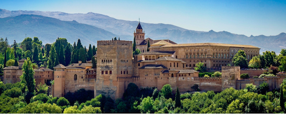

* Information section giving detailed info on what is language immersion, why our company and what we offer, and a section explaining what kind of experience you can expect by signing up for one of our courses/holidays.

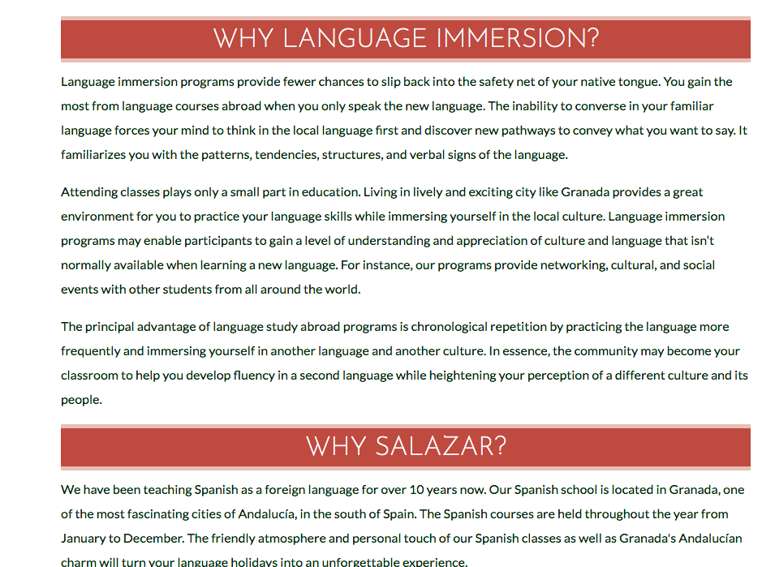

* An introduction to the team here at Salazar to create a more personalised feel and give clients the confidence to contact with any questions they may have. 

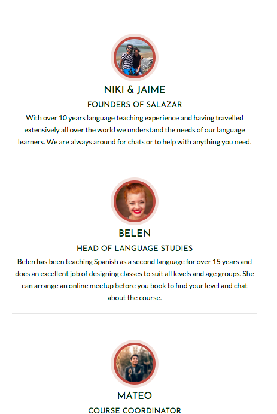

* Footer which provides a clickable icon to bring you to the contact page where you can request more information. There are also Trip Advisor, Instagram, Twitter and facebook icons which would lead to more reviews, information and photos for interested potential customers.

#### Feature 3: Courses page

* Navbar with the option of clicking Book Now to produce a modal with booking options.

* Carousal giving snippets of information about the courses provided and photos related to the courses.

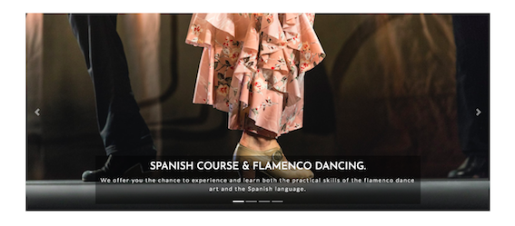

* Information section giving descriptions of the courses, including prices. Each section has a Book Now button leading to the booking modal.

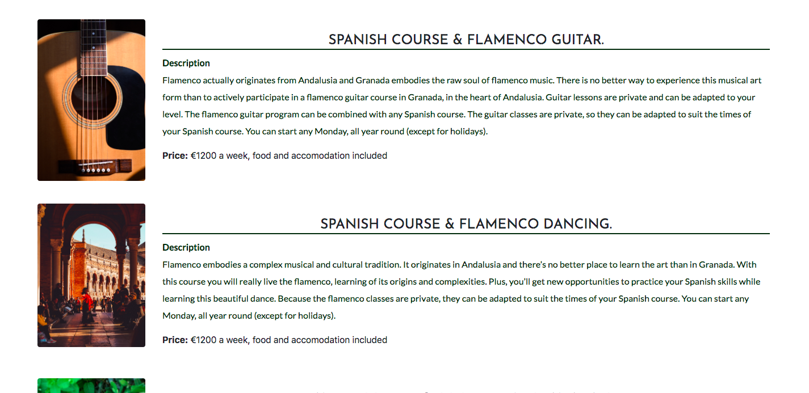

* Footer which provides a clickable icon to bring you to the contact page where you can request more information. There are also Trip Advisor, Instagram, Twitter and facebook icons which would lead to more reviews, information and photos for interested potential customers.

#### Feature 4: Contact form

* Navbar with the option of clicking Book Now to produce a modal with booking options.

* Contact form where you can submit your name, email, subject matter and message to contact the team at Salazar.

* Google Maps section which shows the location of the company. 

* Contact information section tails of address, telephone, business hours and email address for both information and booking departments.

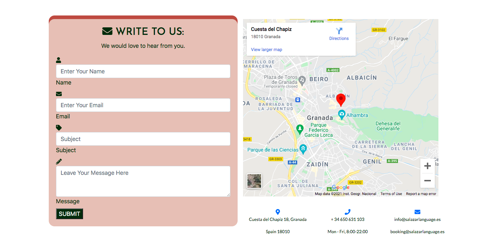

* Footer which provides a clickable icon to bring you to the contact page where you can request more information. There are also Trip Advisor, Instagram, Twitter and facebook icons which would lead to more reviews, information and photos for interested potential customers.

#### Feature 5: Modal used for booking.

* Modal form which can be accessed from every page. Consists of text area for name, dropdown to calendar to select start and finish dates. It also includes dropdowns to choose number of rooms, number of adults and number of children. You can enter your email and phone number and click book now.

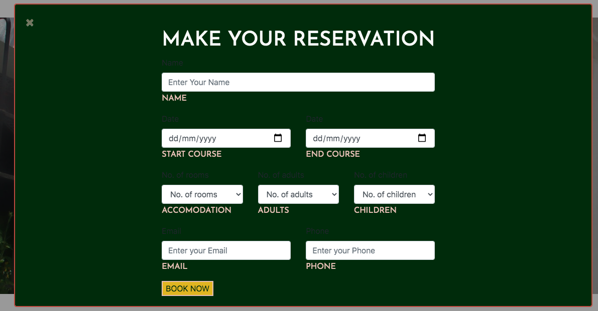

### TECHNOLOGIES USED <hr>

Languages used:

* HTML 5
* CSS
- [Gitpod](https://gitpod.io) 
    - Used **Gitpod** as my open source platform.
- [Github](https://github.com/) 
    - Used **Github** as my code hosting platform
- [Google Fonts](https://fonts.google.com/)
    - This project uses **Google fonts** to style the website fonts.
- [BootstrapCDN](https://www.bootstrapcdn.com/)
    - This project uses **Bootstrap4** to simplify the structure of the website and make the website responsive
    - This project also uses BootstrapCDN to provide icons from [FontAwesome](https://www.bootstrapcdn.com/fontawesome/)

- [jQuery](https://jquery.com/)
    - This project uses **jQuery** to reference Javascript needed for the responsive navbar.
- [Popper.js](https://popper.js.org/)
    - **Popper.js** was used to reference Javascript needed for the responsive navbar.
- [WAVE](https://wave.webaim.org)
    - Used **WAVE** to evaluate my code to ensure the content is fully accessable to individuals with disabilities.
- [W3 HTML](https://validator.w3.org/)
    - Used **W3 HTMLs** for HTML code valuation
- [Jigsaw CSS](https://jigsaw.w3.org/css-validator/)
    - Used **Jigsaw CSS** to Validate CSS Code
- [Balsamic](https://balsamiq.com/)
    - Used **Balsamic** to create [WIREFRAMES](#wireframes)
- [Minify Code](http://minifycode.com/html-beautifier/)
    - **Minify Code** is a tool I used to minify and beautify CSS and HTML codes


### TESTING <hr>

#### User Goals Testing

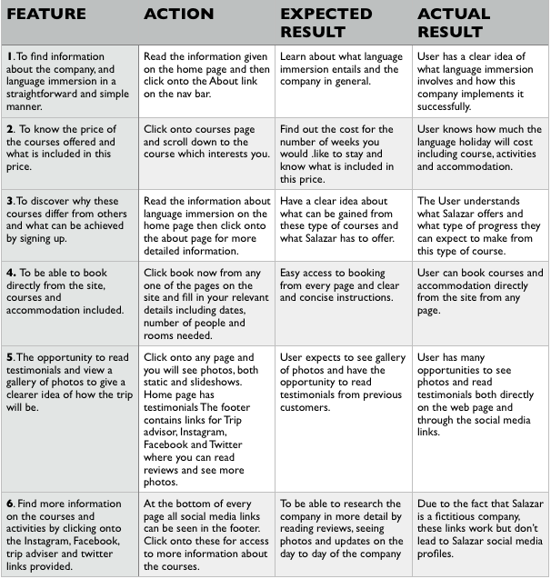

#### User Stories Testing

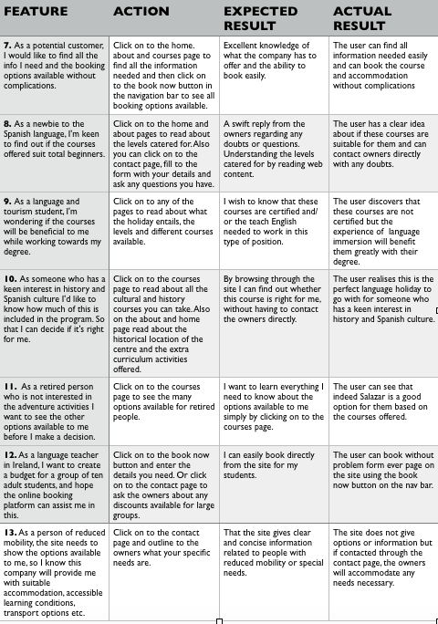

#### Site Owner Goals Testing

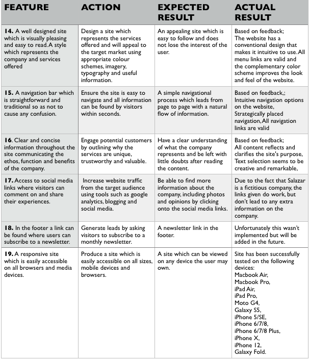

### BUGS FOUND AND THEIR FIXES <hr>

    1. Header image on the contact page is skewed to the right on some screens.
    - added media quiery for mobile devices placing margin-right at 5% and margin-left at 5%.

    2. An error in HTML validator stated that an aria-disabled attribute whose value is true should not be specified as an a element that has a href attribute.
    - removed aria-disabled="true" from all buttons in footer.

    3. An error in HTML validator stated that w-100 was not allowed.
    - Changed all image sizes to width="100"

    4. Map aligned to left on ipad devices.
    - Added a media quiery to  align-content: center; padding-right: 40px;

    5. An error in HTML validator stated that the aria-controls attribuye must point to an element in the same document.
    - Removed an unneccessary id from about.html

    

### PERFORMANCE <hr>

Google Lighthouse was used to measure the speed and performance of the website. 

#### Home

* [Lighthouse Desktop Home](docs/testing/desktop-home-LH.png)

* [Lighthouse Mobile Home](docs/testing/mobile-home-LH.png)

#### About

* [Lighthouse Desktop About](docs/testing/desktop-about-LH.png)

* [Lighthouse Mobile About](docs/testing/mobile-about-LH.png)

#### Courses

* [Lighthouse Desktop Courses](docs/testing/desktop-courses-LH.png)

* [Lighthouse Mobile Courses](docs/testing/mobile-courses-LH.png)

#### Contact

* [Lighthouse Desktop Contact](docs/testing/desktop-contact-LH.png)

* [Lighthouse Mobile Contact](docs/testing/mobile-contact-LH.png)

### ACCESSIBILITY <hr>

WAVE Web Accessibility Evaluation Tool was used to test the sites accessibility. Each page conveys this message "Congratulations! No errors were detected! Manual testing is still necessary to ensure compliance and optimal accessibility".

#### Home

* [Home Page Evaluation](docs/validation/home-wave.png)


#### About

* [About Page Evaluation](docs/validation/about-wave.png)


#### Courses

* [Courses Page Evaluation](docs/validation/courses-wave.png)


#### Contact

* [Contact Page Evaluation](docs/validation/contact-wave.png)

### HTML AND CSS VALIDATION <hr>


* [HTML Validation](docs/validation/w3-validator-HTML-checker.png)


* [CSS Validation](docs/validation/w3c-css-validation.png) 


### DEPLOYMENT <hr>

This project was developed using the [Gitpod](https://gitpod.io), committed to git, and pushed to GitHub using the Gitpod terminal. 

To deploy this page to GitHub Pages from its [GitHub repository](https://nikimacm.github.io/milestone-1-salazar/), the following process was completed: 
1. Log into GitHub. 
2. Click on the account avatar in the top right corner and select "Your repositories" from the dropdown menu.
3. From the list of repositories, select **gbrw**.
4. From the menu bar at the top of the page, select **Settings**.
5. In the menu bar on the left side of the screen, select the second menu item from the bottom, "Pages."
6. In the **Source** section, select **Master Branch** from the dropdown menu, then click on **Save**.
7. As a result, the page is refreshed and the website deployed. The **website URL** appears in a blue box above the **Source Section**.

At the moment of submitting this Milestone project the Development Branch and Master Branch are identical. 

### How to run this project locally
To clone this project into Gitpod you will need a Github account. [Create a Github account here](https://github.com/)

Then follow these steps:
1. Log into [Gitpod](https://gitpod.com) with your gitpod account.
2. Navigate to the [Project GitHub repository](https://github.com/nikimacm/milestone-1-salazar)
3. Click the green "Gitpod" button in the top right corner of the respository
4. This will trigger a new gitpod workspace to be created based on the code in GitHub. There, you will be able to work locally.

To work on the project code within a local IDE such as VSCode, Sublime Text, etc.:
1. Navigate to the [Project GitHub repository](https://github.com/nikimacm/milestone-1-salazar)
2. Click the "Code" download button next to the green "Gitpod" button.
3. In the Clone section, select HTTPs and copy the clone URL for the repository. 
4. Open your local terminal.
5. Change the current working directory to the location where you want the cloned directory to be located.
6. Type ```git clone```, and then paste the URL you copied in Step 4.
7. Press Enter for your local clon to be created.


### CREDITS<hr>

#### Images

I downloaded all the images for this site from upsplash.com.

* Photo by <a href="https://unsplash.com/@grwood?utm_source=unsplash&utm_medium=referral&utm_content=creditCopyText">Petr Slováček</a> on <a href="https://unsplash.com/s/photos/granada?utm_source=unsplash&utm_medium=referral&utm_content=creditCopyText">Unsplash</a>
* Photo by <a href="https://unsplash.com/@lodyssee_belle?utm_source=unsplash&utm_medium=referral&utm_content=creditCopyText">L'odyssée Belle</a> on <a href="https://unsplash.com/s/photos/granada?utm_source=unsplash&utm_medium=referral&utm_content=creditCopyText">Unsplash</a>
* Photo by <a href="https://unsplash.com/@victoriano?utm_source=unsplash&utm_medium=referral&utm_content=creditCopyText">Victoriano Izquierdo</a> on <a href="https://unsplash.com/s/photos/granada?utm_source=unsplash&utm_medium=referral&utm_content=creditCopyText">Unsplash</a>
* Photo by <a href="https://unsplash.com/@kazuo513?utm_source=unsplash&utm_medium=referral&utm_content=creditCopyText">Kazuo ota</a> on <a href="https://unsplash.com/s/photos/flamenco-dancer?utm_source=unsplash&utm_medium=referral&utm_content=creditCopyText">Unsplash</a>
* Photo by <a href="https://unsplash.com/@jpfiles_av?utm_source=unsplash&utm_medium=referral&utm_content=creditCopyText">JP Files</a> on <a href="https://unsplash.com/s/photos/flamenco-dancer?utm_source=unsplash&utm_medium=referral&utm_content=creditCopyText">Unsplash</a>
* Photo by <a href="https://unsplash.com/@kazuo513?utm_source=unsplash&utm_medium=referral&utm_content=creditCopyText">Kazuo ota</a> on <a href="https://unsplash.com/s/photos/flamenco-dancer?utm_source=unsplash&utm_medium=referral&utm_content=creditCopyText">Unsplash</a>
* Photo by <a href="https://unsplash.com/@dolodol?utm_source=unsplash&utm_medium=referral&utm_content=creditCopyText">Dolo Iglesias</a> on <a href="https://unsplash.com/s/photos/flamenco-dancer?utm_source=unsplash&utm_medium=referral&utm_content=creditCopyText">Unsplash</a>
* Photo by <a href="https://unsplash.com/@amygatenby?utm_source=unsplash&utm_medium=referral&utm_content=creditCopyText">Amy Gatenby</a> on <a href="https://unsplash.com/s/photos/flamenco-dancer?utm_source=unsplash&utm_medium=referral&utm_content=creditCopyText">Unsplash</a>
* Photo by <a href="https://unsplash.com/@dylu?utm_source=unsplash&utm_medium=referral&utm_content=creditCopyText">Jacek Dylag</a> on <a href="https://unsplash.com/s/photos/guitar?utm_source=unsplash&utm_medium=referral&utm_content=creditCopyText">Unsplash</a>
* Photo by <a href="https://unsplash.com/@dylu?utm_source=unsplash&utm_medium=referral&utm_content=creditCopyText">Jacek Dylag</a> on <a href="https://unsplash.com/s/photos/guitar?utm_source=unsplash&utm_medium=referral&utm_content=creditCopyText">Unsplash</a>
* Photo by <a href="https://unsplash.com/@ahungryblonde_?utm_source=unsplash&utm_medium=referral&utm_content=creditCopyText">Sara Dubler</a> on <a href="https://unsplash.com/s/photos/spanish-food?utm_source=unsplash&utm_medium=referral&utm_content=creditCopyText">Unsplash</a>
* Photo by <a href="https://unsplash.com/@samferrara?utm_source=unsplash&utm_medium=referral&utm_content=creditCopyText">Samuel Ferrara</a> on <a href="https://unsplash.com/s/photos/skiing?utm_source=unsplash&utm_medium=referral&utm_content=creditCopyText">Unsplash</a>
* Photo by <a href="https://unsplash.com/@aaronburden?utm_source=unsplash&utm_medium=referral&utm_content=creditCopyText">Aaron Burden</a> on <a href="https://unsplash.com/s/photos/hiking?utm_source=unsplash&utm_medium=referral&utm_content=creditCopyText">Unsplash</a>
  
#### Code

Credit for the code used on the booking modal: https://www.w3schools.com/bootstrap4/bootstrap_modal.asp. I used snippets of this code and edited it to make it fit in the project.

My brother in law Pedro del Gallego guided me in using javascript to access the modal. 

Credit for the code used to make the carousel: https://www.w3schools.com/bootstrap4/bootstrap_carousel.asp. Again I used snippets of this code and edited it to fiT in with the project.

 
 ### ACKNOWLEDGEMENTS<hr><hr>
 * My mentor Mo Shami for his guidance and advice even on holidays and weekends. He really helped to keep me motivated and on track throughout the project.
 * My brother in law Pedro de Gallego for introducing me to web development and all the support he has given me since I first developed an interest.
 * The team at Code Institute for their help and support.